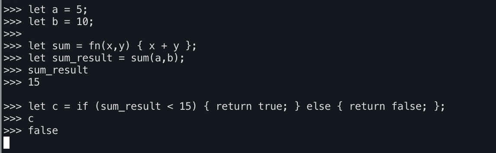

# interpreter
A interpreter written in go for a made up language.

# Example program

```go
let a = 5;
let b = 10;

let sum = fn(x, y) {
    x + y;
};

let sum_result = sum(a, b);

let c = if (sum_result < 15) {
    return true;
} else {
    return false;
};
```

The value of `c` should be `false`;

Example from the repl.


